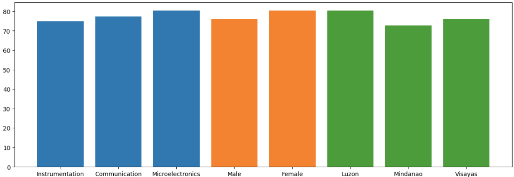

# EXPERIMENT 4 - Data Wrangling and Data Visualization
This repository contains my solutions for the fourth experiment in ECE 2112: Advanced Computer Programming and Algorithms. I've used Jupyter Notebook to implement and test my Python code. The data is sourced from the board2.xlsx file, located within the Jupyter notebook folder. The code will automatically print the results.<br />

### Library Used
- Pandas: is built on NumPy and provides easy-to-use data structures and data analysis tools for the Python programming language.
- Matplotlib: is Python 2D plotting library which produces publication-quality figures in a variety of hardcopy formats and interactive environments across platforms.

### Problem 1
1. Create the following data frames based on the format provided: Filename: Vis = [“Name”, “Gender”, “Track”, “Math<70”]; hometown is constant as Visayas

| Name | Gender | Track | Math |
| --- | --- | --- | --- |
| S4 | Male | Instrumentation | 65 |
| S11 | Female | Communication | 48 |
| S22 | Female | Communication | 64 |
2. Filename: Instru = [“Name”, “GEAS”, “Electronics >70”]; where track is constant as Instrumentation and hometown Luzon
3. Filename: Mindy = [ “Name”, “Track”, “Electronics”, “Average >=55”]; where hometown is constant as Mindanao and gender Female

### Problem 2
Create a visualization that shows how the different features contributes to average grade. Does chosen track in college, gender, or hometown contributes to a higher average score?

## Sample Output
This section showcasing the expected output for each problem, formatted as code blocks for clarity.
### Problem 1
```
1. Vis
	Name	Gender	Track		Math
3	S4	Male	Instrumentation	65
10	S11	Female	Communication	48
21	S22	Female	Communication	64

2. Instru
	Name	GEAS	Electronics
6	S7	60	60
8	S9	63	36

3. Mindy
	Name	Track			Electronics	Average
1	S2	Communication		75		67.25
2	S3	Instrumentation		74		72.75
14	S15	Microelectronics	41		59.00
16	S17	Microelectronics	79		70.50
19	S20	Communication		60		66.50
```

### Problem 2


## Contact Information
Name: Prince Emmanuel Estoque<br /> 
Email: princeemmanuel.estoque.eng@ust.edu.ph
